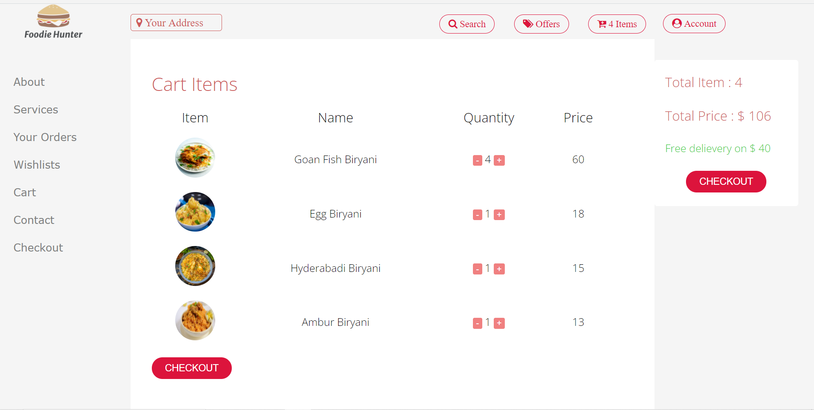
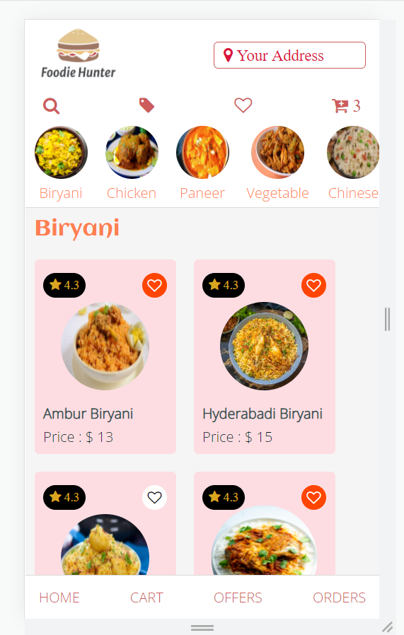
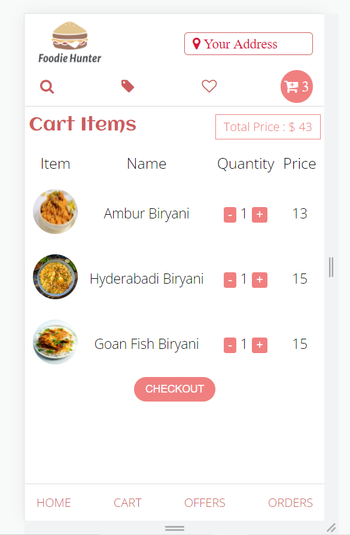

# mini_foodApp

<h1>features</h1>  
-user can select food  
-user can see perticular section  
-user can add it to cart  

[visit site](https://myfoodapp2.netlify.app/)

<h1>glimpses</h1>

## Tech Stack :- 

- #### HTML
- #### CSS
- #### Javascript

</img>

